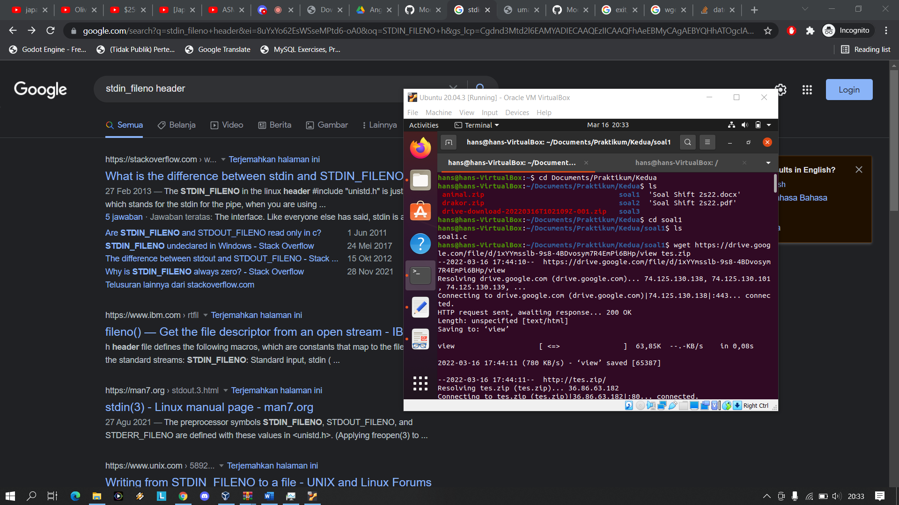
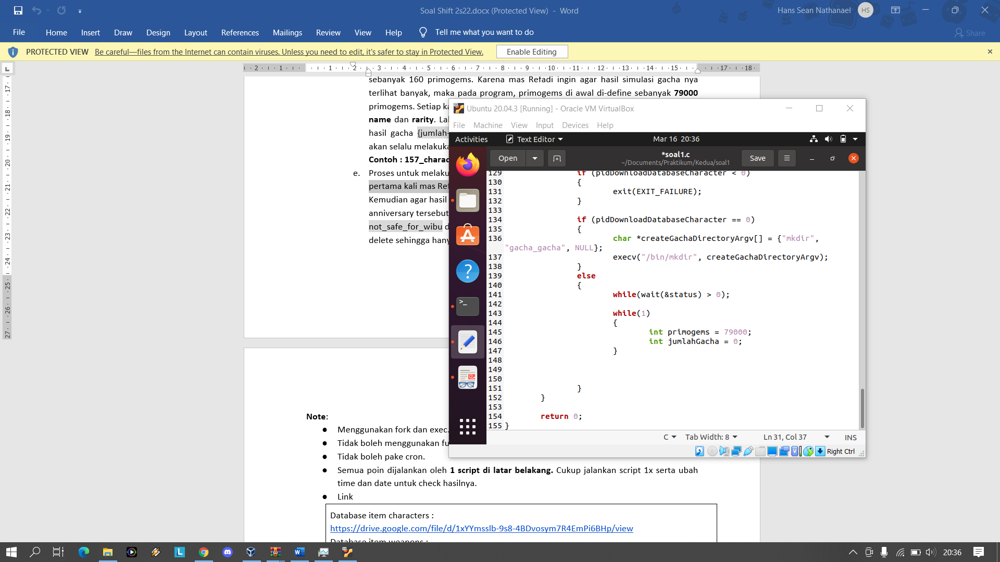
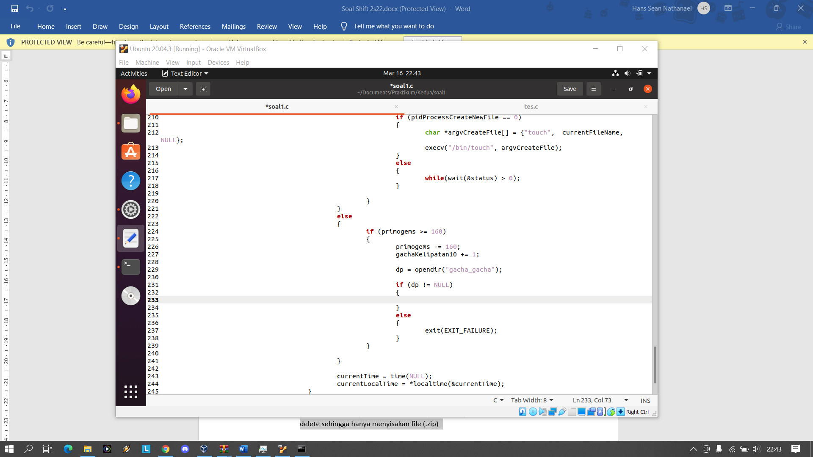
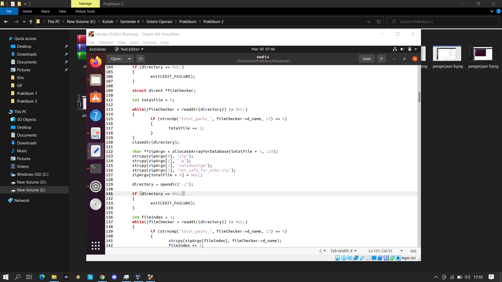

# Soal Shift Sisop Modul 2 2022

Repository untuk soal shift sisop modul 2 kelompok B07 tahun 2022

Anggota:

1. Hans Sean Nathanael (5025201019)
2. Jayanti Totti Andhina (5025201037)
3. Agnesfia Anggraeni (5025201059)


## Nomor 1

```bash
int getTotalDatabase(char *database)
{
	int result = -1;
	DIR *databaseDirectory = opendir(database);
	
	if (databaseDirectory != NULL)
	{
		struct dirent *fileData;
		int totalFile = 0;
		
		while((fileData = readdir(databaseDirectory)) != NULL)
		{
			if (strcmp(fileData->d_name, ".") != 0 && strcmp(fileData->d_name, "..") != 0)
			{
				totalFile += 1;
			}
		}
		
		result = totalFile;
		
		closedir(databaseDirectory);
	}
	
	return result;
}
```

Fungsi getTotalDatabase untuk mendapatkan jumlah file database yang berada di directory database.

```bash
void getFileNameInDatabase(char **arrayDatabase, char *database)
{
	DIR *databaseDirectory = opendir(database);
	
	if (databaseDirectory != NULL)
	{
		struct dirent *fileData;
		int totalFile = 0;
		
		while((fileData = readdir(databaseDirectory)) != NULL)
		{
			if (strcmp(fileData->d_name, ".") != 0 && strcmp(fileData->d_name, "..") != 0)
			{
				strcpy(arrayDatabase[totalFile], fileData->d_name);
				totalFile += 1;				
			}
		}
		
		closedir(databaseDirectory);
	}
}
```

Fungsi getFileNameInDatabase untuk menyimpan semua nama file yang ada di directory database ke dalam array string.

```bash
char **allocateArrayForDatabase(int arraySize, int bufferSize)
{
	char **array;
	
	array = (char**)malloc(sizeof(char*) * arraySize);
	
	for(int i = 0; i < bufferSize; i++)
	{
		array[i] = (char*)malloc(sizeof(char) * bufferSize);
	}
	
	return array;
}
```

Fungsi allocateArrayForDatabase untuk mengalokasikan memori untuk array string

```bash
void deallocateArrayOfDatabase(char **arrayDatabase)
{
	int length = sizeof(arrayDatabase) / sizeof(arrayDatabase[0]);
	
	for (int i = 0; i < length; i++)
	{
		free(arrayDatabase[i]);
	}
	free(arrayDatabase);
}
```

Fungsi deallocateArrayOfDatabase untuk mengdealokasikan memori sebuah array string.

```bash
void zipGachaFile()
{
	if(chdir("gacha_gacha") < 0)
	{
		exit(EXIT_FAILURE);
	}
	
	DIR *directory = opendir("./");
	
	if (directory == NULL)
	{
		exit(EXIT_FAILURE);
	}
	
	struct dirent *fileChecker;
	
	int totalFile = 0;
	
	while((fileChecker = readdir(directory)) != NULL)
	{
		if (strncmp("total_gacha_", fileChecker->d_name, 12) == 0)
		{
			totalFile += 1;
		}
	}
	closedir(directory);

	char **zipArgv = allocateArrayForDatabase(totalFile + 6, 128);
	strcpy(zipArgv[0], "zip");
	strcpy(zipArgv[1], "-P");
	strcpy(zipArgv[2], "satuduatiga");
	strcpy(zipArgv[3], "-r");
	strcpy(zipArgv[4], "not_safe_for_wibu.zip");
	zipArgv[totalFile + 5] = NULL;
	
	directory = opendir("./");
	
	if (directory == NULL)
	{
		exit(EXIT_FAILURE);
	}
		
	int fileIndex = 5;
	while((fileChecker = readdir(directory)) != NULL)
	{
		if (strncmp("total_gacha_", fileChecker->d_name, 12) == 0)
		{
			strcpy(zipArgv[fileIndex], fileChecker->d_name);
			fileIndex += 1;
		}
	}
	closedir(directory);
	
	execv("/bin/zip", zipArgv);
}
```

Fungsi zipGachaFile untuk zip semua file hasil gacha yang disimpan di dalam directory gacha_gacha dengan password "satuduatiga".

```bash
void clearGachaGachaDirectory()
{
	if(chdir("gacha_gacha") < 0)
	{
		exit(EXIT_FAILURE);
	}
	
	DIR *directory = opendir("./");
	
	if (directory == NULL)
	{
		exit(EXIT_FAILURE);
	}
	
	struct dirent *fileChecker;
	
	pid_t pidRemoveDirectoryProcess = 0;
	int status;
	
	while((fileChecker = readdir(directory)) != NULL)
	{
		if (strncmp("total_gacha_", fileChecker->d_name, 12) == 0)
		{
			pidRemoveDirectoryProcess = 0;
			pidRemoveDirectoryProcess = fork();
			
			if (pidRemoveDirectoryProcess == 0)
			{
				char *removeDirectoryArgv[] = {"rm", "-rf", fileChecker->d_name, NULL};
				execv("/bin/rm", removeDirectoryArgv);
			}
			else
			{
				while(wait(&status) > 0);
			}
		}
	}
	exit(EXIT_SUCCESS);
}
```

Fungsi clearGachaGachaDirectory untuk menghapus semua file hasil gacha yang terdapat di dalam directory gacha_gacha

### fungsi main ###

```bash
pid_t pidDaemonProcess = 0, sidDaemonProcess;
	
pidDaemonProcess = fork();

if (pidDaemonProcess < 0)
{
	exit(EXIT_FAILURE);
}
else if (pidDaemonProcess > 0)
{
	exit(EXIT_SUCCESS);
}

// masuk dalam daemon

umask(0);

sidDaemonProcess = setsid();

if (sidDaemonProcess < 0)
{
	exit(EXIT_FAILURE);
}

close(STDIN_FILENO);
close(STDOUT_FILENO);
close(STDERR_FILENO);
```

Membuat daemon terlebih dahulu

```bash
pid_t pidDownloadDatabaseCharacter = 0;
	
pidDownloadDatabaseCharacter = fork();

if (pidDownloadDatabaseCharacter < 0)
{
	exit(EXIT_FAILURE);
}

if (pidDownloadDatabaseCharacter == 0)
{
	// process untuk mengunduh zip database weapon dan character
	// dan kemudian mengextract zip tersebut
	
	pid_t pidDownloadDatabaseWeapon = 0;
	
	pidDownloadDatabaseWeapon  = fork();
	
	if (pidDownloadDatabaseWeapon < 0)
	{
		exit(EXIT_FAILURE);
	}
	
	if (pidDownloadDatabaseWeapon == 0)
	{
		// mengunduh zip database character
		// dan mengextract zip tersebut
		
		pid_t pidExtractFileDBWeapon = 0;
		
		pidExtractFileDBWeapon = fork();
		
		if (pidExtractFileDBWeapon < 0)
		{
			exit(EXIT_FAILURE);
		}
		
		if (pidExtractFileDBWeapon == 0)
		{
			// mengunduh zip database character
			
			char *argvDownloadWeaponDB[] = {
				"wget", 
				"--no-check-certificate", 
				"-q", 
				"https://drive.google.com/uc?id=1XSkAqqjkNmzZ0AdIZQt_eWGOZ0eJyNlT&export=download", 
				"-O", 
				"db_weapon.zip", NULL
			};
		
			execv("/bin/wget", argvDownloadWeaponDB);
		}
		else
		{
			// mengextract zip database character
			
			int statusProcessDownloadDBWeapon;
			while(wait(&statusProcessDownloadDBWeapon) > 0);
			
			char *unzipWeaponDBArgv[] = {"unzip", "-q",  "db_weapon.zip", NULL};
			execv("/bin/unzip", unzipWeaponDBArgv);
		}
		
	}
	else
	{
		// mengunduh zip database weapon
		// dan kemudian mengextract zip tersebut
	
		int statusProcessDBWeapon;
		while(wait(&statusProcessDBWeapon) > 0);
		
		pid_t pidExtractFileDBCharacter = 0;
		
		pidExtractFileDBCharacter = fork();
		
		if (pidExtractFileDBCharacter < 0)
		{
			exit(EXIT_FAILURE);
		}
		
		if (pidExtractFileDBCharacter == 0)
		{
			// mengunduh zip database weapon
			
			char *argvDownloadCharacterDB[] = {
				"wget", 
				"--no-check-certificate", 
				"-q", 
				"https://drive.google.com/uc?id=1xYYmsslb-9s8-4BDvosym7R4EmPi6BHp&export=download", 
				"-O", 
				"db_character.zip", 
				NULL
			};
			
			execv("/bin/wget", argvDownloadCharacterDB);
		}
		else
		{
			// mengextract zip database weapon
			
			int statusProcessDownloadDBCharacter;
			while(wait(&statusProcessDownloadDBCharacter) > 0);
			
			char *unzipCharacterDBArgv[] = {"unzip", "-q", "db_character.zip", NULL};
			execv("/bin/unzip", unzipCharacterDBArgv);
			
		}
		
	}
}
```

Kemudian membuat proses-proses untuk mengunduh file database dari link Google Drive yang disediakan dengan wget dan di unzip setelahnya

```bash
int status;
while(wait(&status) > 0);

// membuat child process yang bertugas membuat
// directory "gacha_gacha"

pid_t pidCreateGachaDirectory = 0;
pidCreateGachaDirectory = fork();

if (pidCreateGachaDirectory < 0)
{
	exit(EXIT_FAILURE);
}

if (pidCreateGachaDirectory == 0)
{
	// membuat directory gacha_gacha
	
	char *createGachaDirectoryArgv[] = {"mkdir", "gacha_gacha", NULL};
	execv("/bin/mkdir", createGachaDirectoryArgv);
}
```

Kemudian membuat proses lagi untuk membuat directory "gacha_gacha"

```bash
time_t currentTime; // mendapatkan waktu dalam second
struct tm currentLocalTime; // menyimpan data waktu yang telah dibagi menjadi tahun, bulan, hari, jam, menit, detik

// jam, menit, dan detik mulai dan berhenti proccess diconvert ke detik
// agar mudah dilakukan perbandingan
// dengan jam, menit, dan detik saat sekarang
// prevHourSecond untuk menyimpan waktu sebelumnya karena program diminta menciptakan file
// gacha txt dengan waktu yang berbeda setiap 1 detik
int startHourSecond = 4 * 3600 + 44 * 60;
int finishHourSecond = startHourSecond + 3 * 3600;
int currentHourSecond, prevHourSecond;
```

Setelah membuat directory "gacha_gacha" barulah masuk pada proses gacha, karena proses gacha baru akan dimulai pada tanggal 30 Maret pukul 04:44, maka
perlu mendapatkan waktu dari sistem dan jam, menit, dan detik dari sistem sekarang, waktu mulai, dan waktu berhenti gacha diubah menjadi satuan detik 
untuk mempermudah perbandingan. Struct tm currentLocalTime untuk menyimpan waktu sistem dalam tahun, bulan, hari, jam, menit, dan detik 

```bash
currentTime = time(NULL);
currentLocalTime = *localtime(&currentTime);
currentHourSecond = currentLocalTime.tm_hour * 3600 + currentLocalTime.tm_min * 60 + currentLocalTime.tm_sec;
```

Variabel yang menyimpan waktu sistem sekarang akan diperbaiki terus menerus kemudian nilainya diubah dan disimpan ke dalam struct tm currentLocalTime
untuk mempermudah mengambil tahun, bulan, hari, jam, menit, dan detik sistem.

```bash
if (
	currentLocalTime.tm_mday == 30 && currentLocalTime.tm_mon == 2 && 
	currentHourSecond >= startHourSecond && currentHourSecond < finishHourSecond
)
```

Bila masuk ke dalam rentang waktu gacha maka proses gacha akan dimulai.

```bash
srand(time(NULL));

int primogems = 79000;
int jumlahGacha = 0;
int gachaKelipatan10 = 10;

char currentFileNamePrefix[128];
char currentFileName[256];
char currentFileNewName[256];
char gachaDirectoryName[256];
char gachaDirectoryNewName[256];
char directoryAndFileName[1024];
char directoryAndFileNameRename[1024];

FILE *fileWriter;
FILE *fileReader;
char databaseJSONFileName[256];
char jsonBuffer[4096];

struct json_object *parsedJSON;
struct json_object *jsonDataRarity;
struct json_object *jsonDataName;
char gachaDataString[256];

time_t previousTimeFileCreated = time(NULL)-1;

int databaseCharacterTotal = 0;
int databaseWeaponTotal = 0;

DIR *databaseCharacterDirectory = opendir("characters");
DIR *databaseWeaponDirectory = opendir("weapons");

if (databaseCharacterDirectory == NULL || databaseWeaponDirectory == NULL)
{
	exit(EXIT_FAILURE);
}

int totalCharacterInDatabase = getTotalDatabase("./characters");
int totalWeaponInDatabase = getTotalDatabase("./weapons");
int checkTotalCharacterInDatabase = 0;
int checkTotalWeaponInDatabase = 0;
int randomIndex = 0;


if (totalCharacterInDatabase < 1 || totalWeaponInDatabase < 1)
{
	exit(EXIT_FAILURE);
}

char **databaseCharacterFileName = allocateArrayForDatabase(totalCharacterInDatabase, 256);
char **databaseWeaponFileName = allocateArrayForDatabase(totalWeaponInDatabase, 256);

getFileNameInDatabase(databaseCharacterFileName, "./characters");
getFileNameInDatabase(databaseWeaponFileName, "./weapons");
```

Ketika akan dimulai random gacha, akan diinisialisasi dahulu variabel-variabel yang dibutuhkan dan seed random diacak. Kemudian
mengambil data-data database weapon dan character yaitu jumlah file database character dan weapon dan menyimpan nama-nama
file database ke dalam array string.

```bash
while(
	currentLocalTime.tm_mday == 30 && currentLocalTime.tm_mon == 2 && 
	currentHourSecond >= startHourSecond && currentHourSecond < finishHourSecond
)
```

Selama masih di dalam rentang waktu gacha, proses akan terus menerus terjebak pada proses pengacakan gacha.

```bash
if (gachaKelipatan10 == 10)
{
	if (currentTime > previousTimeFileCreated)
	{
		
		gachaKelipatan10 = 0;
		previousTimeFileCreated = currentTime;
		
		if (jumlahGacha % 90 == 0)
		{
			sprintf(
				gachaDirectoryName,
				"gacha_gacha/total_gacha_%d",
				jumlahGacha + 1
			);
			
			pid_t pidNewDirectoryGacha = 0;
		
			pidNewDirectoryGacha = fork();
			
			if (pidNewDirectoryGacha < 0)
			{
				exit(EXIT_FAILURE);
			}
			
			if (pidNewDirectoryGacha == 0)
			{
				
				
				char *argvCreateNewGachaDir[255] = {"mkdir", gachaDirectoryName, NULL};
				execv("/bin/mkdir", argvCreateNewGachaDir);
			}
			else
			{
				while(wait(&status) > 0);	
			}
		}
		
		sprintf(
			currentFileNamePrefix, 
			"%02d:%02d:%02d_gacha_",
			currentLocalTime.tm_hour, 
			currentLocalTime.tm_min,
			currentLocalTime.tm_sec 
		);
		
		sprintf(
			currentFileName, 
			"%s%d.txt",
			currentFileNamePrefix,
			jumlahGacha
		);
	}
}
```

Jika total gacha kelipatan 10 maka akan membuat file baru dan bila kelipatan 90 maka akan dibuat folder penyimpanan gacha yang baru.
Tetapi jika belum lewat 1 detik dari file sebelumnya yang dibuat, maka akan ditunggu sampai lewat 1 detik barulah proses ini akan dijalankan.

```bash
if (primogems >= 160)
{
	primogems -= 160;
	gachaKelipatan10 += 1;
	jumlahGacha += 1;
	
	sprintf(
		directoryAndFileName, 
		"%s/%s",
		gachaDirectoryName,
		currentFileName
	);
	
	
	if (jumlahGacha % 2 == 0)
	{
		checkTotalWeaponInDatabase = getTotalDatabase("./weapons");
		if (checkTotalWeaponInDatabase != totalWeaponInDatabase)
		{
			if (checkTotalWeaponInDatabase < 1)
			{
				exit(EXIT_FAILURE);
			}
			
			totalWeaponInDatabase = checkTotalWeaponInDatabase;
			deallocateArrayOfDatabase(databaseWeaponFileName);
			databaseWeaponFileName = allocateArrayForDatabase(totalWeaponInDatabase, 256);
			getFileNameInDatabase(databaseWeaponFileName, "./weapons");
		}
		
		
		randomIndex = rand() % totalWeaponInDatabase;
		
		sprintf(databaseJSONFileName, "weapons/%s", databaseWeaponFileName[randomIndex]);
		
		fileReader = fopen(databaseJSONFileName, "r");
		fread(jsonBuffer, 4096, 1, fileReader);
		fclose(fileReader);
		
		
		parsedJSON = json_tokener_parse(jsonBuffer);
		json_object_object_get_ex(parsedJSON, "name", &jsonDataName);
		json_object_object_get_ex(parsedJSON, "rarity", &jsonDataRarity);
		
		sprintf(
			gachaDataString, 
			"%d_weapons_%s_%s_%d", 
			jumlahGacha, 
			json_object_get_string(jsonDataRarity),
			json_object_get_string(jsonDataName),
			primogems
		);
	}
	else
	{
		checkTotalCharacterInDatabase = getTotalDatabase("./characters");
		if (checkTotalCharacterInDatabase != totalCharacterInDatabase)
		{
			if (checkTotalCharacterInDatabase < 1)
			{
				exit(EXIT_FAILURE);
			}
			totalCharacterInDatabase = checkTotalCharacterInDatabase;
			deallocateArrayOfDatabase(databaseCharacterFileName);
			databaseCharacterFileName = allocateArrayForDatabase(totalCharacterInDatabase, 256);
			getFileNameInDatabase(databaseCharacterFileName, "./characters");
		}
		
		
		randomIndex = rand() % totalCharacterInDatabase;
		
		sprintf(databaseJSONFileName, "characters/%s", databaseCharacterFileName[randomIndex]);
		
		fileReader = fopen(databaseJSONFileName, "r");
		fread(jsonBuffer, 4096, 1, fileReader);
		fclose(fileReader);
		
		
		parsedJSON = json_tokener_parse(jsonBuffer);
		json_object_object_get_ex(parsedJSON, "name", &jsonDataName);
		json_object_object_get_ex(parsedJSON, "rarity", &jsonDataRarity);
		
		sprintf(
			gachaDataString, 
			"%d_characters_%s_%s_%d", 
			jumlahGacha, 
			json_object_get_string(jsonDataRarity),
			json_object_get_string(jsonDataName),
			primogems
		);
	}
	
	fileWriter = fopen(directoryAndFileName, "a");
	
	fprintf(fileWriter, "%s\n", gachaDataString);
	 
	fclose(fileWriter);
	
	sprintf(
		currentFileNewName, 
		"%s%d.txt",
		currentFileNamePrefix,
		jumlahGacha
	);
	
	sprintf(
		directoryAndFileNameRename, 
		"%s/%s",
		gachaDirectoryName,
		currentFileNewName
	);
	
	pid_t pidUpdateFileName = 0;
	pidUpdateFileName = fork();
	
	if (pidUpdateFileName < 0)
	{
		exit(EXIT_FAILURE);
	}
	
	if (pidUpdateFileName == 0)
	{
		char *argvRenameDir[] = {
			"mv",
			directoryAndFileName,
			directoryAndFileNameRename,
			NULL
		};
		
		execv("/bin/mv", argvRenameDir);
	}
	else
	{
		while(wait(&status) > 0);
		strcpy(currentFileName, currentFileNewName);
		
		sprintf(
			gachaDirectoryNewName,
			"gacha_gacha/total_gacha_%d",
			jumlahGacha
		);
		
		pidUpdateFileName = 0;
		pidUpdateFileName = fork();
		
		if (pidUpdateFileName < 0)
		{
			exit(EXIT_FAILURE);
		}
		
		if (pidUpdateFileName == 0)
		{
			char *argvRenameDir[] = {
				"mv",
				gachaDirectoryName,
				gachaDirectoryNewName,
				NULL
			};
			
			execv("/bin/mv", argvRenameDir);
		}
		else
		{
			while(wait(&status) > 0);
			strcpy(gachaDirectoryName, gachaDirectoryNewName);
		}
	}
}
```

Tetapi jika total gacha bukan kelipatan 10, maka akan dilakukan pengacakan gacha. Pertama-tama dengan mengecek perubahan jumlah file pada database 
dan bila terjadi perubahan jumlah akan dilakukan perbaruan jumlah database dan array string yang menyimpan nama file database sehingga
bila ada file yang hilang atau bertambah file baru saat proses sedang berjalan tidak akan merusak sistem gacha. Bila ada file yang mengalami perubahan
nama tetapi jumlah file tidak berubah akan merusak sistem gacha.

Kemudian file database yang diacak akan dibuka dan disimpan datanya ke dalam file gacha, kemudian file gacha dan directory gacha akan diperbarui
namanya.

```bash
currentTime = time(NULL);
currentLocalTime = *localtime(&currentTime);
currentHourSecond = currentLocalTime.tm_hour * 3600 + currentLocalTime.tm_min * 60 + currentLocalTime.tm_sec;
```

Setiap kali proses gacha berjalan, data waktu sistem akan diperbarui terus menerus.

```bash
pid_t pidZIPProcess = 0;
pidZIPProcess = fork();


if (pidZIPProcess == 0)
{
	zipGachaFile();
}
else
{
	while(wait(&status) > 0);
	
	pid_t pidDeleteGachaGacha = 0;
	pidDeleteGachaGacha = fork();
	
	if (pidDeleteGachaGacha == 0)
	{
		clearGachaGachaDirectory();
	}
	else
	{
		while(wait(&status) > 0);
	}
}
```

Di akhir setelah waktu sistem tidak berada pada tanggal 30 Maret antara pukul 4:44 sampai 7:44, sistem akan melakukan zip semua file dan direktori gacha
dan semua file dan direktori gacha yang berada di dalam folder "gacha_gacha" akan dibersihkan. Kemudian proses daemon akan menunggu lagi hingga
waktu sistem memenuhi rentang waktu proses gacha.

**Dokumentasi Pengerjaan dan Rintangan**







Rintangan yang dihadapi adalah cara mengunduh file dari Google Drive menggunakan wget, kemudian cara mengganti nama file dan folder gacha setiap kali terjadi penambahan gacha, kemudian zip folder-folder gacha, juga terjadi process leak karena proses menghapus folder-folder gacha namun semua rintangan berhasil diselesaikan.

## Nomor 2

Soal nomor 2 terkait poster drama korea. 

- Seperti program C pada umumnya, di awal program terdapat library-library yang digunakan.
- Terdapat `struct Drakor` yang berisi nama file, judul drakor, tahun rilis, kategori, dan `boolean max`.
- Terdapat juga variabel global untuk menyimpan path folder dan file zip, serta deklarasi fungsi yang akan digunakan.

```c++
#include <stdlib.h>
#include <sys/types.h>
#include <unistd.h>
#include <stdio.h>
#include <wait.h>
#include <string.h>
#include <dirent.h>
#include <stdbool.h>
#include <sys/stat.h>

struct Drakor {
  char raw_title[100];
  char title[100];
  int year;
  char category[30];
  bool max;
};

char *path = "/home/oem/shift2/drakor";
char *path_zip = "/home/oem/Downloads/drakor.zip";

int compare_by_category(const void *drakor1, const void *drakor2);
void move_to_folder(struct Drakor drakor, bool is_first);
...
```

1. Masuk ke soal 2a, diminta untuk meng-*extract* isi file zip ke folder “/home/[user]/shift2/drakor”, tetapi yang diperlukan saja. 
- Melakukan `fork()` *process*, kemudian karena akan terdapat 2 *process*, maka dilakukan `fork()` lagi. Sehingga untuk *child process* adalah membuat folder, dan *parent process* adalah meng-*extract* zip.
- Extract zip untuk file saja dengan meng-*exclude* folder yang ada di dalam file zip menggunakan argumen `-x */*`. 

```c++
...
if (child_id_1 == 0) {
  child_id_2 = fork();
  int status2;

  if (child_id_2 == 0) {
    char *argv[] = {"mkdir", "-p", path, NULL};
    execv("/bin/mkdir", argv);
  } else {
    while ((wait(&status2)) > 0);
    char *argv[] = {"unzip", path_zip, "-d", path, "-x", "*/*", NULL};
    execv("/usr/bin/unzip", argv);
  }
}
...
```

2. Kami menggabungkan soal 2b, 2c, 2d, 2e menjadi satu fungsi penyelesaian menggunakan data struct.
- Karena *child process* digunakan untuk `mkdir` dan `unzip`, maka kembali ke *parent process* untuk mengkategorikan file.
- Pertama, dilakukan listing folder.
```c++
...
  else {
    while ((wait(&status1)) > 0);
    DIR *dir_path;
    struct dirent *dir;
    int count = 0;
    int title_count = 0;
    char file_name[100][100];
    dir_path = opendir(path);

    while ((dir = readdir(dir_path))) {
      if (strcmp(dir->d_name, ".") != 0 && strcmp(dir->d_name, "..") != 0) {
        strcpy(file_name[count], dir->d_name);
        ++count;
      }
    }
...
```
- Kemudian dilakukan pemisahan string berdasarkan '_' dan ';' untuk mendapatkan data-data sesuai pada `struct Drakor`. Hal ini bertujuan untuk mempermudah pengkategorian nantinya.
```c++
...
    for (int i = 0; i < count; ++i) {
      int semicolon = 0;
      int underscore = 0;
      int index = 0;
      char temp[100];

      for (int j = 0; j < strlen(file_name[i]); ++j) {
        if (file_name[i][j] == '_' || file_name[i][j] == '.') {
          temp[index] = '\0';
          index = 0;
          semicolon = 0;
          strcpy(drakor[title_count].raw_title, file_name[i]);
          strcpy(drakor[title_count].category, temp);

          if (file_name[i][j] == '_') ++underscore;
          if (file_name[i][j] == '.') {
            if (underscore == 0) {
              drakor[title_count].max = true;
            } else {
              if (strcmp(drakor[title_count].category, drakor[title_count-1].category) > 0)
                drakor[title_count].max = true;
              else 
                drakor[title_count-1].max = true;
            }
            underscore = 0;
          }
          ++title_count;
        } else if (file_name[i][j] == ';') {
          temp[index] = '\0';
          index = 0;
          if (semicolon > 0) {
            drakor[title_count].year = atoi(temp);
          } else {
            strcpy(drakor[title_count].title, temp);
          }
          ++semicolon;
        } else {
          temp[index] = file_name[i][j];
          ++index;
        }
      }
    }
...
```
- Karena juga diminta untuk membuat file `data.txt` yang berisi kategori, nama drakor, dan tahun rilis, serta harus diurutkan berdasarkan tahun rilis, maka dilakukan sorting struct menggunakan fungsi `qsort` pada C.
```c++
...
  bool is_first = false;
    qsort(drakor, title_count, sizeof(struct Drakor), compare_by_category);
...
// fungsi sorting yang digunakan:
int compare_by_category(const void *drakor1, const void *drakor2) {
  struct Drakor *d1 = (struct Drakor *)drakor1;
  struct Drakor *d2 = (struct Drakor *)drakor2;
  int category_compare = strcmp(d2->category, d1->category);
  if (category_compare == 0) {
    return d1->year - d2->year;
  } else {
    return -category_compare;
  }
}
...
```
- Setelah itu baru semua struct diproses untuk dipindahkan ke folder masing-masing sekaligus dibuat file `data.txt`.
```c++
...
    for (int i = 0; i < title_count; ++i) {
      if (i == 0 || (i > 0 && 
        strcmp(drakor[i].category, drakor[i-1].category) > 0)) is_first = true;
      move_to_folder(drakor[i], is_first);
      is_first = false;
    }
...
```
- Pada fungsi `move_to_folder`, dilakukan `fork()` *process*. Pada *child process*, dibuat folder berdasarkan kategori drakor. 
```c++
...
  if (child_id_1 == 0) {
    char *argv[] = {"mkdir", "-p", dest_path, NULL};
    execv("/bin/mkdir", argv);
  }
... 
```
- Kemudian pada *parent process*, dibuat file `data.txt` jika belum ada, namun jika sudah ada maka data akan di-*append* ke file tersebut.
```c++
...
    fileptr = fopen(path_txt, "a");
    if (is_first) {
      fprintf(fileptr, "kategori: %s\n", drakor.category);
    }
    fprintf(fileptr, "\nnama: %s\nrilis: tahun %d\n", drakor.title, drakor.year);
    fclose(fileptr);
...
```
- Dilakukan `fork()` kembali pada *parent process* untuk memindahkan atau menyalin poster drakor ke dalam folder kategori yang sesuai.
```c++
...
    if (child_id_2 == 0) {
      if (drakor.max) {
        char *argv[] = {"mv", oldfile, newfile, NULL};
        execv("/bin/mv", argv);
        exit(0);
      } else {
        char *argv[] = {"cp", oldfile, newfile, NULL};
        execv("/bin/cp", argv);
        exit(0);
      }
    } else {
      return;
    }
...
```

**Dokumentasi Pengerjaan dan Rintangan**

## Nomor 3

**Dokumentasi Pengerjaan dan Rintangan**
